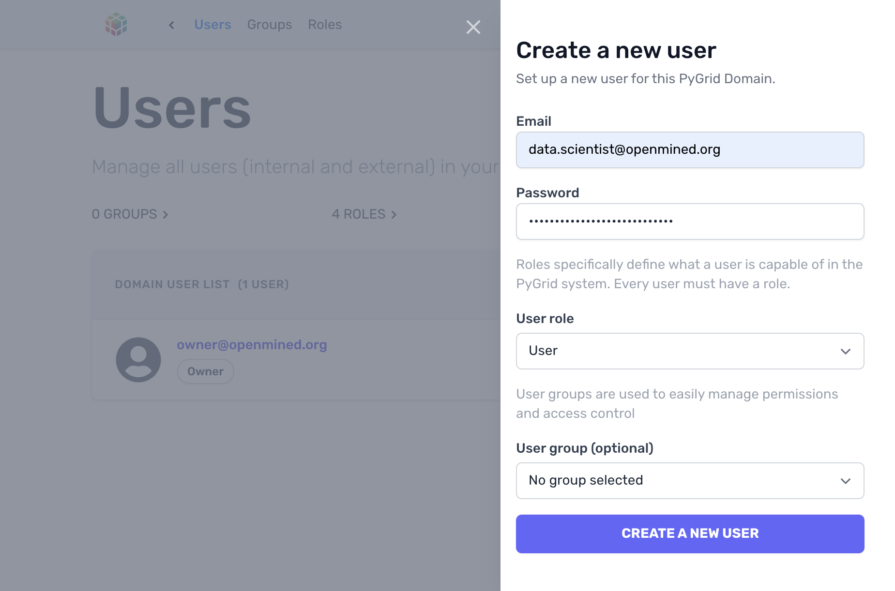
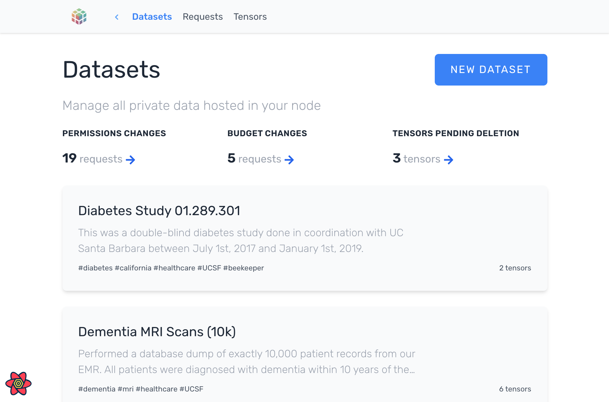
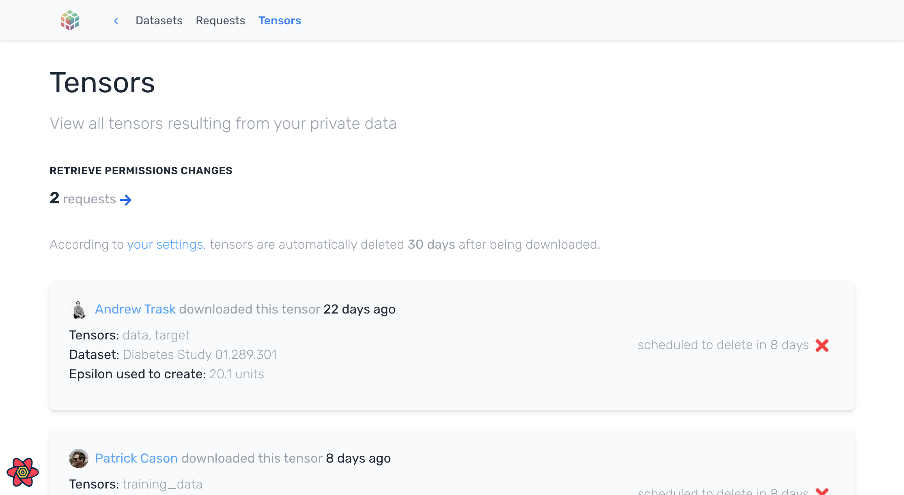
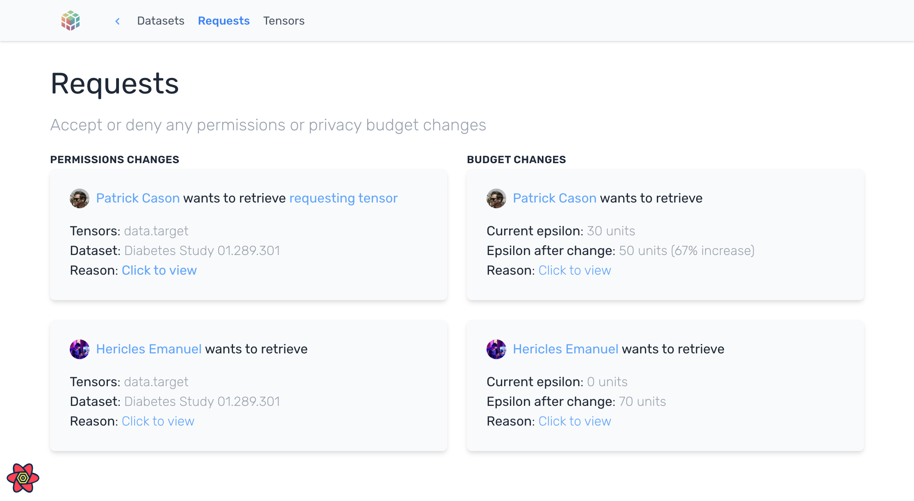
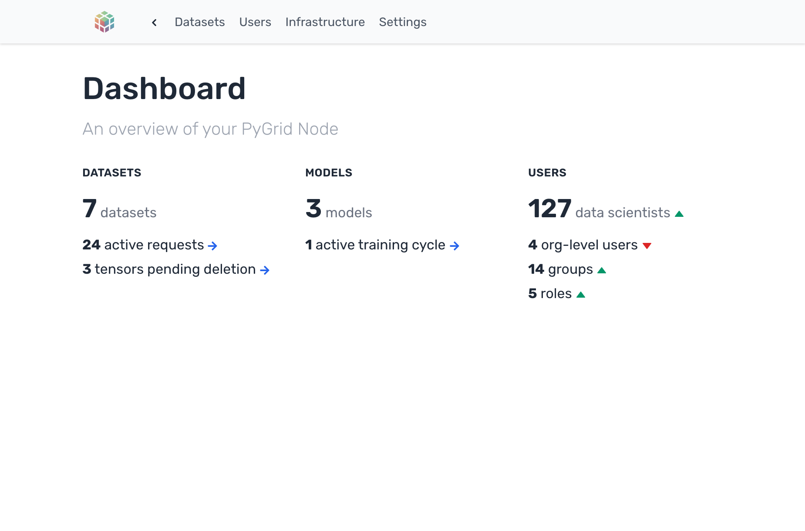

# PyGrid Admin

PyGrid Admin is the user interface that allows data owners to manage their **deployed** PyGrid Domain or Network. This
project provides a way to visualize privacy budgets, configure many infrastucture settings for your Domain or Network
and manage users and datasets.

## Screenshots

<div>
  
  
  
  
  
  
</diV>

## Deployment

The Admin UI can be hosted in static file services such as Amazon S3, Netlify, Google Cloud, Vercel or Heroku, and can
be easily deployed to your own network. It was deliberately built separately from PyGrid to allow for the a very simple
deployment.

```bash
yarn install
yarn build
yarn next export
```

## Development

Yes! We want your help. Head over to [issues](/../../issues) and help us improve the look and feel of the project or the
provide the functionality that seems to be missing.

Run the development server:

```bash
git clone git@github.com:OpenMined/PyGrid.git
cd pygrid-admin
yarn install
yarn dev
```

The PyGrid Admin should be available at [http://localhost:3000](http://localhost:3000).

## Disclaimer

We are reaching full support for the latest PyGrid Domain API version. And we know that the interface is not ideal.
Please report to us any issues you have and keep in mind that we are working diligently to provide a better support in
the upcoming versions.

## Contributing & Support

If you're interested in contributing, please join the **#support** Slack channel.
[Click here to join our Slack community!](https://slack.openmined.org)

## License

[Apache License 2.0](https://github.com/OpenMined/PySyft/blob/master/LICENSE)
[](https://app.fossa.io/projects/git%2Bgithub.com%2FOpenMined%2FPySyft?ref=badge_large)
